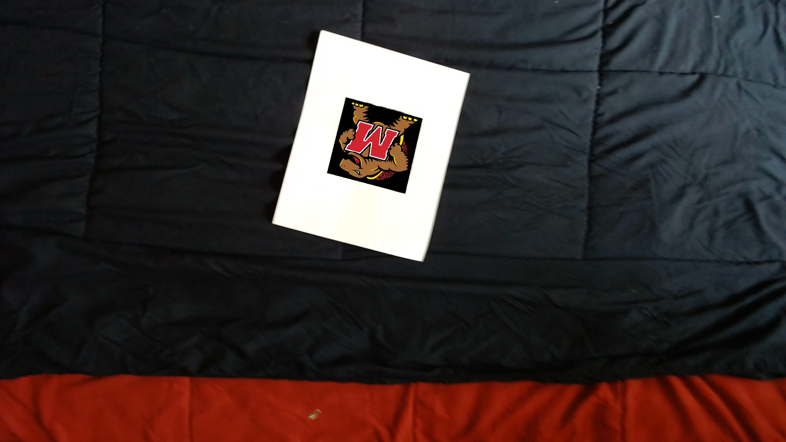
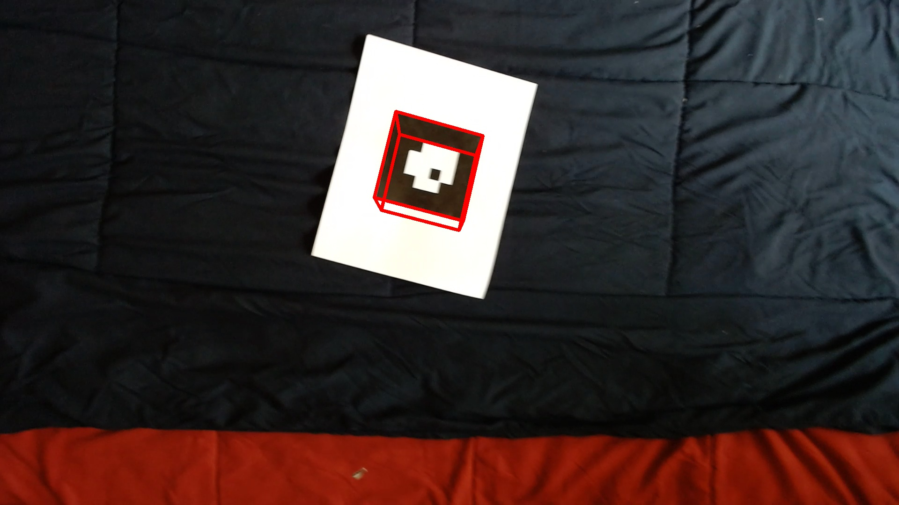

# AR tag detection
This project is praticing how to utilize Fast Fourier Transform to detect image edges.  
Then find the AR tag direction and plug other images or cube into AR tag in the right direction.  
To run this code, it is required cv2, numpy, math, and sys. matplotlib is optional.  
Open a terminal under the path of file and type  
```bash
python AR_detection.py
```
It will take some time to generate the video.  
If there is no need to generate the video, replace the show_XXX with False.  
Noticing that this file doesn't perfectly solve any frame in the video, It might require to stop the terminal when it runs over 5mins.  
The output will show several images and videos.  
Images will provides testudo plugging into the tag and cube on the tag.  
The video will show those above images in every frame performance.  
The main problem of failing to success in every frame is that threshold sometimes produces errors on the image.  
By only measuring the points in the image, it may require specific method to capture the four corners of the tag.  
However, there are still a lot of successful frame in the video.  
Here is a good outcome of one frame.  
AR tag detection  
  
Testudo  
  
Cube  
  
