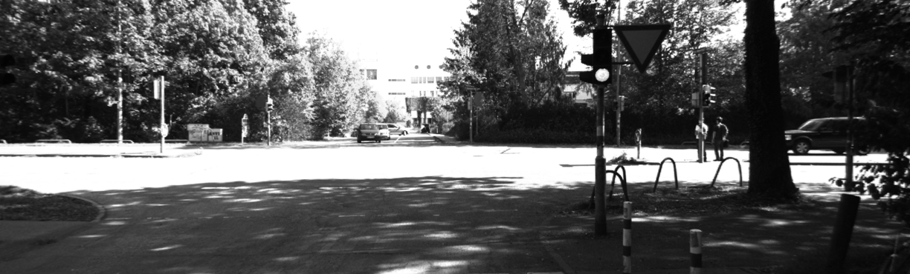

# Lane detection practice
This project is praticing how to use histogram equalizations and detect straight and curve lane lines.  
The prerequirement is to place adaptive_hist_data, whiteline.mp4, and challenge.mp4 under the file.  
The environment is based on python3, OpenCV, and numpy.  
## Histogram equalizations
To run the code, please type  
```bash
python3 Proj2_1.py
```
It will create two videos "out1.avi" and "out2.avi".  
out1.avi will show the image after histogram equalizations  
out2.avi will show the image after adaptive histogram equalizations  
Take an image for example:  
Original image  
 
Histogram equalizations image  
 
Adaptive histogram equalizations image  
 
## Straight Lane Detection  
To run the code, please type  
```bash
python3 Proj2_2.py
```  
It will create one video "output2_2.avi" and show greeen for solid line and red for dashed line.  
Take an image for example:  
Original image  
   
Result image  
  
## Predict Turn  
To run the code, please type  
```bash  
python3 Proj2_3.py
```
It will create one video "output2_3.avi" and predict the turn with arrows.  
Take an image for example:  
Original image  
   
Result image  
 
