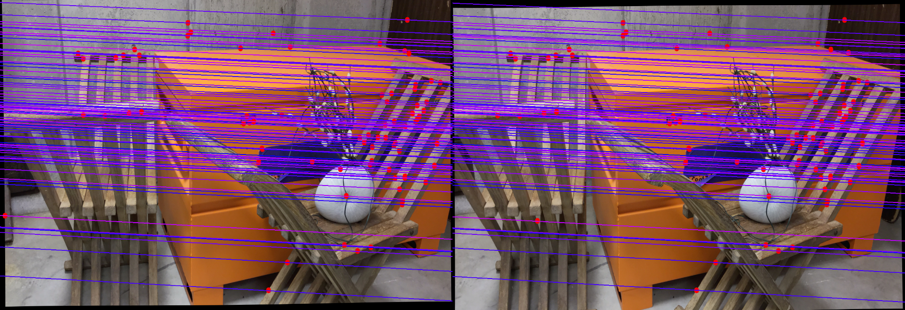
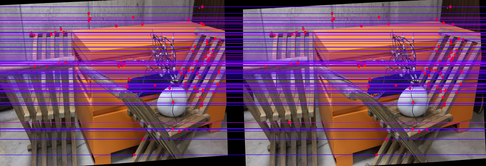
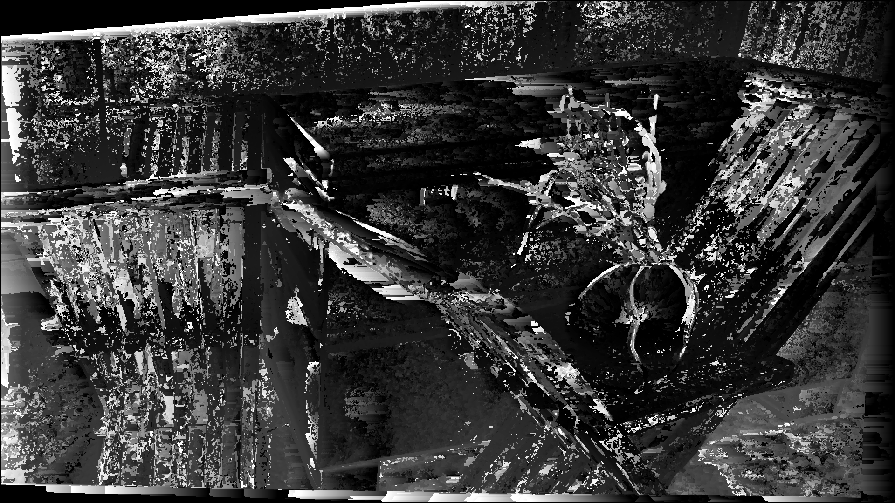
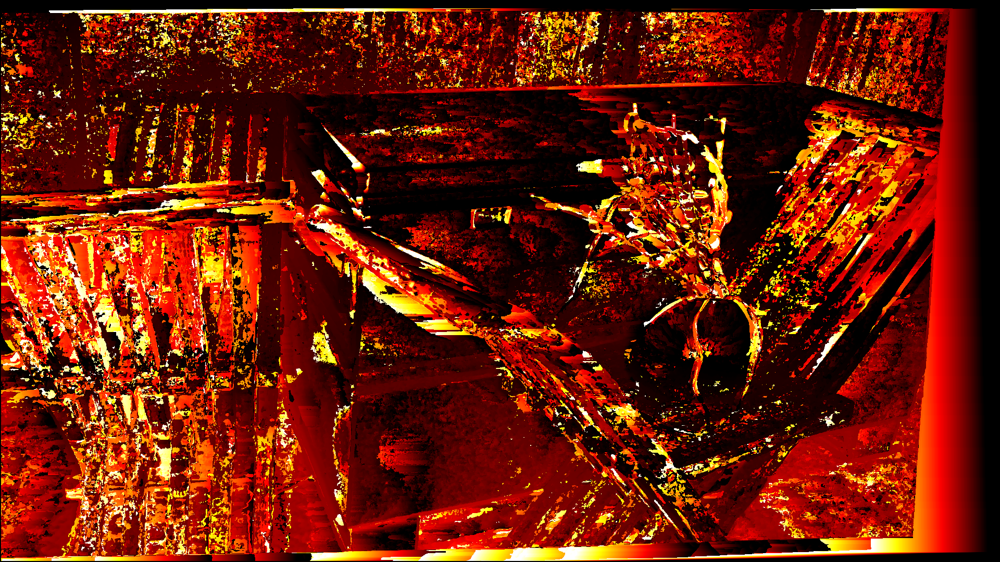
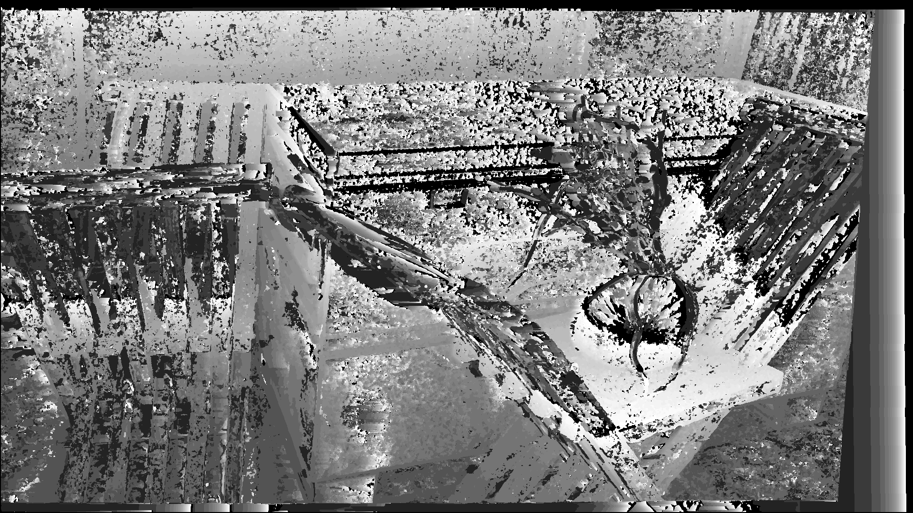
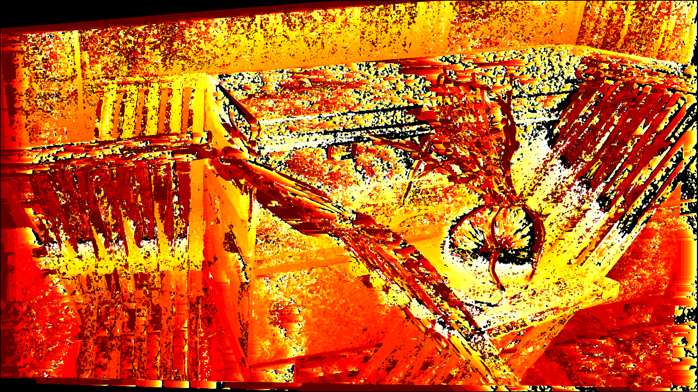

# Stereo Vision System
This task is to compute depth from two different angle images.  
To run the code, please type under the file   
```bash
python3 Proj3.py
```
Then there are three options.  
Type 1 for curule images, type 2 for octagon images, and type 3 for pendulum images.  
Default option is curule images.  
These two images will process Calibration, Rectification, Corrrespondence, and Compute Depth Image.  
In terminal, after entering the desired options.  
It will show fundamental, roatation, translation, H1, and H2 matrix.  
This information will be similar with the data in calib.txt  
For images, it will store 6 images in file.  
unrectified with epipolar lines, rectified with epipolar lines, disparity gray, disparity heatmap, depth gray, and depth heatmap  
It may take some time to output images. SSD function should process at least one minutes.  
Take curule for examples:  
Unrectified with epipolar lines  
  
Rectified with epipolar lines  
 
Disparity gray  
 
Disparity heatmap  
 
Depth gray  
 
Depth heatmap  
   
Those information could be viewed in following [link](https://drive.google.com/drive/folders/10e34TAw6BJ9skk570BSWG2RwWWBb9FsG?usp=sharing)  
[Github Link](https://github.com/liudiepie/ENPM673/tree/main/Proj3)  